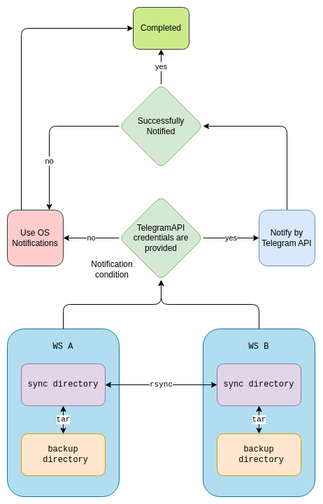

### Simple folder sync

This script do synchronisation of local and remote directory.



### How to use?

Firstly you have to make script executable file

```chmod +x /path/to/sync.sh```

Done. Now you can run the script:

```
/path/to/sync.sh \
  -u <REMOTE_USER> 
  -h <REMOTE_HOST> 
  -r <REMOTE_PATH>
  -l <LOCAL_PATH> 
  -c <COMPRESSION_LEVEL> 
  -a <BACKUP_PATH>
  -t <BOT_TOKEN> (optional)  
  -x <TELEGRAM_CHAT_ID> (optional)  
``` 

### How to use Telegram notifications

1. Create bot
2. Get bot token
3. Start communicate with bot to create chat_id
4. Get chat_id using this command:
   1. ```shell
      curl https://api.telegram.org/bot<BOT_TOKEN>/getUpdates
      ```
5. Set bot_token and chat_id as script command line arguments